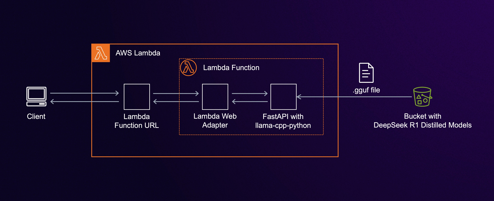

# Serverless DeepSeek R1 Inference with FastAPI and Lambda SnapStart

This project demonstrates how to build a serverless LLM inference API for DeepSeek R1 using AWS Lambda with SnapStart, FastAPI, and llama-cpp-python. It provides a template for deploying DeepSeek R1 Distiled model and other large language models in a serverless environment.

## Architecture



The application consists of:
- FastAPI application running on Lambda for inference requests
- Custom Lambda layer with llama-cpp-python (x86_64)
- Lambda SnapStart for faster cold starts
- AWS Lambda Web Adapter for streaming responses
- S3 for model storage with memfd for efficient loading

## Features

- **Serverless Inference API**
  - FastAPI-based Lambda function
  - Streaming responses via Server-Sent Events
  - OpenAI-compatible chat completions endpoint
  - IAM authentication support

- **Optimized Performance**
  - Lambda SnapStart for reduced cold starts
  - memfd for efficient model loading
  - Parallel model download from S3
  - Custom llama-cpp-python layer with OpenBLAS

- **Interactive Client**
  - Command-line interface with streaming responses
  - Command history with persistence
  - Configurable model parameters
  - Progress indicator for requests

## Prerequisites

- **AWS Requirements**
  - AWS Account with appropriate permissions
  - Lambda function role with S3 access
  - x86_64 architecture support

- **Development Tools**
  * [AWS SAM CLI](https://docs.aws.amazon.com/serverless-application-model/latest/developerguide/serverless-sam-cli-install.html)
  * [Python 3.12](https://www.python.org/downloads/)
  * [Docker](https://hub.docker.com/search/?type=edition&offering=community)

- **IAM Permissions**
  - s3:GetObject for model access
  - lambda:InvokeFunctionUrl for client
  - Additional permissions for deployment

## Performance Considerations

- **Scaling Capabilities**
  - Scale from 0 to 1000 concurrent requests in 10 seconds
  - No pre-provisioning or capacity planning required

- **Cold Start Times**
  - ~1-2 seconds with SnapStart
  - ~20-30 seconds without SnapStart

- **Memory Requirements**
  - Minimum: 2GB Lambda memory for 1.5B 4 bit quant models
  - Recommended: 10GB for better performance

## Security

- **Authentication**
  - IAM authentication for Lambda Function URL
  - AWS SigV4 signing for requests

- **Model Security**
  - S3 bucket encryption
  - IAM policies for model access

## Deployment

1. **Model Preparation**
   ```bash
   # Download the Qwen model
   wget https://huggingface.co/unsloth/DeepSeek-R1-Distill-Qwen-1.5B-GGUF/resolve/main/DeepSeek-R1-Distill-Qwen-1.5B-Q4_K_M.gguf
   
   # Create and configure S3 bucket
   aws s3 mb s3://BUCKET_NAME
   aws s3 cp DeepSeek-R1-Distill-Qwen-1.5B-Q4_K_M.gguf s3://BUCKET_NAME/
   ```

2. **Application Deployment**
   ```bash
   # Build with SAM
   sam build

   # Deploy (guided)
   sam deploy --guided
   ```

   Configuration parameters:
   * **Stack Name**: CloudFormation stack name
   * **AWS Region**: Deployment region
   * **MODEL_BUCKET**: S3 bucket with model
   * **MODEL_KEY**: S3 key for the model file (default: DeepSeek-R1-Distill-Qwen-1.5B-Q4_K_M.gguf)

## Using the Client

### Installation

```bash
# Install dependencies
pip install requests python-dotenv boto3

# Configure API endpoint
echo "CHAT_API_BASE=https://xxxx.lambda-url.us-east-1.on.aws" > .env
```

### Running the Client

```bash
# Basic usage
python client.py

# With configuration
python client.py --api-base https://xxxx.lambda-url.us-east-1.on.aws \
                --temperature 0.6 \
                --max-tokens 512
```

### Features

- **Interactive Interface**
  - Streaming responses with progress indicator
  - Command history (↑/↓ keys)
  - History persistence in `.chat_history`

- **Commands**
  - `/quit` - Exit the chat
  - `/new` - Start a new conversation

- **Configuration**
  - `temperature` (0.0-2.0): Response randomness
  - `max_tokens` (1-8192): Maximum response length

## Local Development

1. **Environment Setup**
   ```bash
   # Create virtual environment
   python -m venv .venv
   source .venv/bin/activate

   # Install dependencies
   cd app
   pip install -r requirements.txt
   ```

2. **Configuration**
   ```bash
   # Create .env file
   cat > .env << EOL
   MODEL_BUCKET=your-bucket-name
   MODEL_KEY=your-model-file.gguf
   EOL
   ```

3. **Running Locally**
   ```bash
   cd app
   uvicorn main:app --reload
   ```

4. **Debugging**
   - Set `LOG_LEVEL=debug` for detailed logging
   - Use VS Code debugger with provided launch configurations
   - Monitor memory usage with `top` or similar tools

## Cleanup

Remove all deployed resources:
```bash
sam delete
```

## Resources

- [AWS Lambda SnapStart](https://docs.aws.amazon.com/lambda/latest/dg/snapstart.html)
- [AWS Lambda Function URLs](https://docs.aws.amazon.com/lambda/latest/dg/lambda-urls.html)
- [AWS Lambda Web Adapter](https://github.com/awslabs/aws-lambda-web-adapter)
- [FastAPI Documentation](https://fastapi.tiangolo.com/)
- [llama-cpp-python](https://github.com/abetlen/llama-cpp-python)

## Security

See [CONTRIBUTING](CONTRIBUTING.md#security-issue-notifications) for more information.

## License

This project is licensed under the MIT-0 License - see the [LICENSE](LICENSE) file for details.